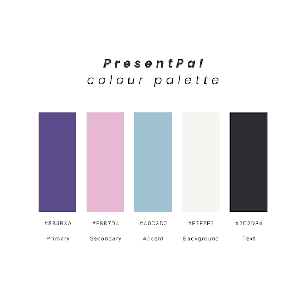

# PresentPal

## Plan. Shop. Joy. 🎄✨

### Tech Turtles

- [PresentPal](#presentpal)
  - [Plan. Shop. Joy. 🎄✨](#plan-shop-joy-)
    - [Tech Turtles](#tech-turtles)
  - [Project Overview 🎁](#project-overview-)
  - [Mission Statement 🔊](#mission-statement-)
  - [Features 📋](#features-)
    - [All Features](#all-features)
    - [Must haves](#must-haves)
    - [Nice to haves - First Priority](#nice-to-haves---first-priority)
    - [Nice to haves - Other](#nice-to-haves---other)
    - [Summary](#summary)
    - [Users](#users)
    - [Christmas List](#christmas-list)
    - [Pages/Endpoint Functionality](#pagesendpoint-functionality)
  - [Technical Implementation 🧑‍💻](#technical-implementation-)
    - [Back-End 👈](#back-end-)
    - [Front-End 👉](#front-end-)
    - [Source Code Management 👷](#source-code-management-)
    - [Deployment ▶️](#deployment-️)
  - [Target Audience 👥](#target-audience-)
  - [User Stories 📖](#user-stories-)
    - [Gift Giver User Stories 👼🏻](#gift-giver-user-stories-)
      - [List Management](#list-management)
      - [Sharing and Collaboration (stretch goal)](#sharing-and-collaboration-stretch-goal)
      - [Mobile Experience](#mobile-experience)
    - [Gift Recipient User Stories 🥳](#gift-recipient-user-stories-)
  - [Front-end Implementation](#front-end-implementation)
    - [Wireframes 🖼️](#wireframes-️)
    - [Logo 💜](#logo-)
    - [Colours 🎨](#colours-)
    - [Font ✍️](#font-️)

## Project Overview 🎁

PresentPal is a web application designed to streamline gift planning and purchasing, starting with a focus on Christmas shopping and with the potential to expand into birthday and other event planning. The platform aims to eliminate the stress of last-minute shopping and provide a more organised and thoughtful approach to gift-giving.

## Mission Statement 🔊

PresentPal’s mission is to simplify holiday/event gift shopping by providing a seamless platform where users can create, organise and share personalised gift lists. Whether for personal use or to help find the perfect gift for loved ones, PresentPal enables easy tracking of items and their sources, making gift-giving more thoughtful, efficient and enjoyable.

## Features 📋

### All Features

- Creation of user account
- Log in/Log out
- Ability to create/edit/delete list
- Add item details and assign to a recipient on the list
- Ability to update the status of individual items
- Accessibility for colour blind users
- Management of budget (total spent)
- Custom 404 page
 Responsive design

### Must haves

- __Homepage__
  - Anyone can view the website
  - Users can create an account. Create account page will have email, first name, last name and password fields
  - Users can create a list if they are logged in
  
- __User Profile Management and Permissions__
  - Users can log in or log out of their account
  - Login page will have full name and password fields
  - Each user category will have their set permissions they can view
  
- __List Page__
  - Admin can create or delete any of the lists
  - Users can create a list, but can only edit/delete a list they have created
  - Has space to record and update gift details (product name, price, store/link or location)
  - Status of item (complete/incomplete)

### Nice to haves - First Priority

1. Priority of item, e.g. when child adds multiple items
2. Status of item (not ordered, ordered but hasn't arrived)
3. Due date when gift is required by
4. Item count - total items

### Nice to haves - Other

- Secure sharing of list, e.g. User wants to send list to children to add ideas
- Grouping of items
- Ability to print list
- QR code generation
- Budget by category
- Birthday list integration
- Gift suggestions
- Sale notifications
- About page
- Forgot password on login page

### Summary

Provide users the ability to create lists of gifts they need to purchase. Once items are listed, users can edit/delete individual items and update each item's status. Only Superuser can view all lists and individual users can view the lists created by them.

### Users

| Type               | Access                                                                                                                                                                                                                                                                                             | Role type assignment                                |
| :----------------- | :------------------------------------------------------------------------------------------------------------------------------------------------------------------------------------------------------------------------------------------------------------------------------------------------- | :-------------------------------------------------- |
| Superuser or admin | - All access     - Can log in and log out    - Create and manage lists    - Create and manage other users    - Create and manage other users    - Can see and edit their details via profile page    - Update status of items on list    - Delete a list | Private: Shelley Behen                                                |
| User      | - Can log in and can log out    - Create and edit items on their list    - Delete item from their list                                                                                                                                     | Public: Users who want to create a gift shopping list |

### Christmas List

| Feature                                        | Access                                                                                                                                                                                                           | Notes/Conditions                                                                                              |
| :--------------------------------------------- | :--------------------------------------------------------------------------------------------------------------------------------------------------------------------------------------------------------------- | :------------------------------------------------------------------------------------------------------------ |
| Create                                         | Can be created by anyone with a registered account                                                                                                                        | User must be logged in |
| View                                           | Admin and creator of the list can view list                                                                                      |                                                                                                               |
| Edit                                           | Admin and creator of the list can edit list                                                                                      |  User must be logged in                                                                                                             |
| Delete                                         | Can be deleted by Admin and creator of list |                                                                                                               |

### Pages/Endpoint Functionality

| Endpoint                          | Functionality              | Comments          |
| :-------------------------------- | :------------------------- | :------------------------- |
| Create and post list              |  - Available to user who created list         | - Easy to read and accessible   - Good contrast |
| Admin page |  - All admin functions   - Can also create another admin account        | - Requires auth   - Initial admin created by DB                            |
| User page | - Users can view all lists created   - Users can create new list  |  |
| Home page  |  - Button to create list or log in button if not logged in   - Description about app    |                            |

## Technical Implementation 🧑‍💻

### Back-End 👈

- Django/DRF API
- Python

### Front-End 👉

- React/JavaScript
- HTML/CSS

### Source Code Management 👷

- Git

### Deployment ▶️

The application's front-end will be deployed to Netlify. The back-end and DB will be deployed to Heroku.

We will also use Insomnia to ensure API endpoints are working smoothly (we will utilise a local and deployed environment in Insomnia).

[Link to Heroku deployed backend](https://presentpals-a951116525a2.herokuapp.com/users/)

## Target Audience 👥

- Gift Giver (Primary User)
- Gift Recipient (Secondary User)
  
PresentPal caters to two key groups in the gift-giving process. The primary users are busy gift-givers, often balancing work and family, who want to organise their holiday shopping efficiently. They use the platform to create gift lists, track recipients, and monitor their shopping progress, reducing stress and last-minute hassles.

The secondary users are gift recipients, who can join in by creating their own wishlists when invited by a gift-giver. This collaborative approach ensures gifts are thoughtful and easier to choose, while still keeping the surprise alive during the holiday season.
  
## User Stories 📖

### Gift Giver User Stories 👼🏻

#### List Management

1. As a gift giver, I want to create a new gift list so that I can organise my Christmas shopping.
2. As a gift giver, I want to add recipients to my list so that I can plan gifts for everyone.
3. As a gift giver, I want to add gift details (name, price, store link/location, notes) so that I can track what to buy.
4. As a gift giver, I want to mark items as purchased so that I can track my shopping progress.
5. As a gift giver, I want to see the total cost of all gifts so that I can manage my budget.
6. As a gift giver, I want to keep the list private from each recipient so that gifts remain a surprise.

#### Sharing and Collaboration (stretch goal)

1. As a gift giver, I want to invite recipients to edit their gift lists so that I know what they want.
2. As a gift giver, I want to share my list with family members so that we can coordinate gift buying.
3. As a gift giver, I want to keep gift details private from recipients so that surprises aren't spoiled.

#### Mobile Experience

1. As a gift giver, I want to access my lists on a mobile device so that I don’t always have to turn on my laptop.
2. As a gift giver, I want the website to load quickly so that I can check lists efficiently.

### Gift Recipient User Stories 🥳

1. As a gift recipient, I want to add items to my gift list so that I receive gifts I'll enjoy.
2. As a gift recipient, I want to edit my gift list so that I can keep it up to date.

## Front-end Implementation

### Wireframes 🖼️

[View Wireframes - Low Fi](https://www.canva.com/design/DAGb5tRGHJ0/UBG7Brk7j-eV03OurxHv4A/edit?utm_content=DAGb5tRGHJ0&utm_campaign=designshare&utm_medium=link2&utm_source=sharebutton)
[View Wireframes - Hi Fi](https://www.canva.com/design/DAGcZu4uqC8/juChQ0FBvADYtmBYPdYJZw/edit?utm_content=DAGcZu4uqC8&utm_campaign=designshare&utm_medium=link2&utm_source=sharebutton)

### Logo 💜

### Colours 🎨

### Font ✍️

